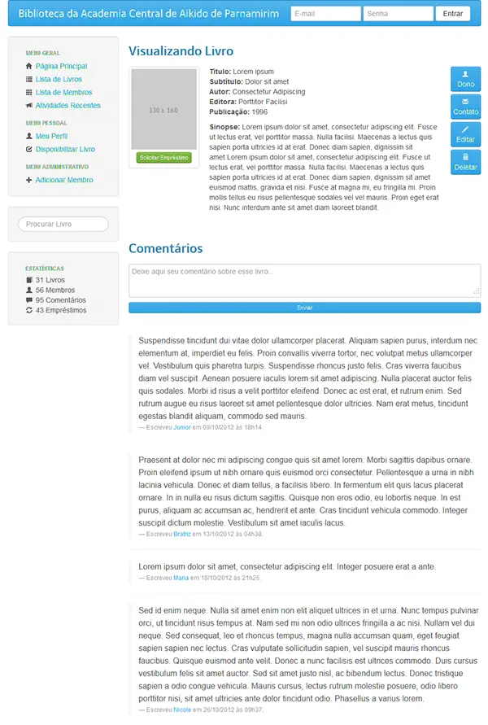

# Book Sharing Platform

> Book borrowing system within a community. Example: A group of undergraduate students who are interested in lending/exchanging books among themselves. The system allowed for the management of the books made available by the users and sent notifications when a user requested a loan. The project was developed in 2012 but was never implemented.