# Cat Goric: Escape from the Warp Chamber - Post-Mortem

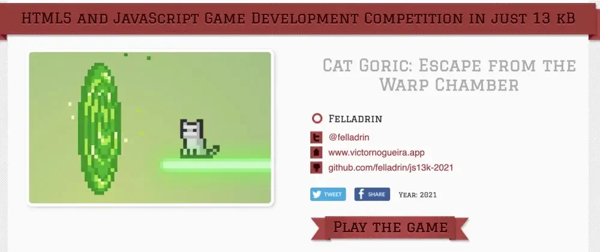

Space was the theme for the [JS13KGames](https://js13kgames.com/) competition in 2021.

I was able to join on the first day (13th August). And after a month, with more than a hundred hours invested in it, [the game](https://js13kgames.com/games/cat-goric-escape-from-the-warp-chamber) was submitted!

But before talking about the making of the game, I need to say why I took part in it: learning. Incredible things happen when we push ourselves to fit a complete game in 13 kilobytes. We discover a lot of unique tools and more efficient ways of developing software. Besides that, all games are open-source, so we grow together with others. [The community](https://twitter.com/search?q=%23js13k) is fantastic!

I tend to create strategy/RPG games cause these are my favorites. Civilization, Total Annihilation, Diablo and Ultima Online are all rooted in my creativity. And I didn't want to create a space shooter, as [Espol.io](https://felladrin.itch.io/espolio) had already made me spend one year on this theme. So I spent a few days thinking about what I could develop.

Meanwhile, I've prepared the [game repository](https://github.com/felladrin/js13k-2021) with the structure to quickly build and zip it.

The plan was to make something that could entertain players for at least 5 minutes. And my initial idea was to create a game in which waves of alien spaceships would bombard Earth. The player in control of a global human alliance would strategically place units on the ground to defend it. Game objects would shoot automatically, so it'd be like a vertical tower defense game. And I planned to call it *"Annihilation Came From Space"*.

While presenting this idea to my wife, she made me realize it wouldn't be as fun as I imagined. And knowing that I submitted [a strategy game last year](https://js13kgames.com/games/population-404), it was reasonable. So I decided to try something different. Something that is a trend; that could look interesting at first sight. And that led to cats!

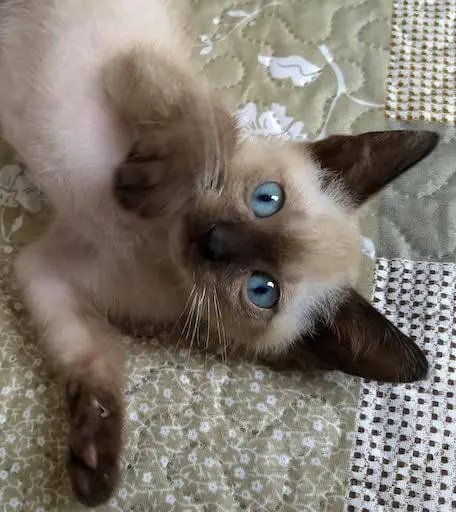

So the new idea was to make a game where a cat would fall from space and collect items while avoiding obstacles all the way down. The artwork would be more cartoon or pixel art.

I needed a hand with art for this case, so I started looking into [Game Assets from Itch.io](https://itch.io/game-assets) and found this [Cat](https://elthen.itch.io/2d-pixel-art-cat-sprites) and this [Portal](https://elthen.itch.io/2d-pixel-art-portal-sprites) sprites by [Elthen's Pixel Art Shop](https://itch.io/profile/elthen). Also, these [coins and gems](https://laredgames.itch.io/gems-coins-free) by [La Red Games](https://laredgames.itch.io/).

But the problem with this idea was that people would play at a maximum of three rounds cause there's not much to do or discover. Also, the randomness of the obstacles would make the game lucky-based.

So I discarded the idea and started thinking about the last game we played together: [Captain Toad: Treasure Tracker](https://www.nintendo.com/us/store/products/captain-toad-treasure-tracker-switch/) - which is a puzzle game. With puzzles, I could let players engaged for more time.

I had the portal, the cat and the items I wanted to use, so I just needed to find a few more assets in Itch.io. At this point, I also had a color pattern based on the portal sprite sheet, so I picked a matching [color palette](https://coolors.co/d9ed92-b5e48c-99d98c-76c893-52b69a-34a0a4-168aad-1a759f-1e6091-184e77) on [Coolors](https://coolors.co/) to follow.

The idea became then escaping from a room that would shrink with time. It would be a game with just three commands: move left, move right and jump. With this, the player would guide a cat to the portal to advance to the next challenge. Great, the base game was finally defined!

From this point, the design started to change faster. The walls of the shrinking room were replaced by the concept of movement-sensitive laser emitters. The room ground where the cat would move became floating platforms, and the idea of using neon came while searching for laser assets. At this moment, I found something that would fit perfectly: a [Neon Platform](https://opengameart.org/content/pong-graphics) by [Deathsbreed](https://opengameart.org/users/deathsbreed).

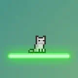

In the process, I also released an NPM Package ([Create PubSub](https://www.npmjs.com/package/create-pubsub)), which I used to manage the state and flow of the game.

And I was still in doubt about using [Kontra](https://straker.github.io/kontra/) or [Replay](https://replay.js.org/) as the game engine. Still, in the end, I decided to use Kontra for having more built-in features I needed, and also because I had used it in [a previous js13k game](https://js13kgames.com/games/population-404).

For rendering the texts in canvas, though, I haven't used the built-in text support from Kontra. Instead, I've used [TinyFont](https://github.com/darkwebdev/tinyfont.js), as it renders perfectly pixelated independently of the game scale.

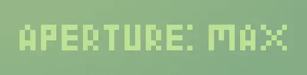

The sound effects were easily added thanks to [ZzFX](https://killedbyapixel.github.io/ZzFX/). This tool can generate sounds that would fit in any game!

[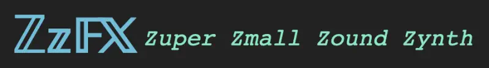](https://killedbyapixel.github.io/ZzFX/)

On the other hand, for the background music, I spent a whole week in research. It all started after [xem](https://twitter.com/MaximeEuziere) released a tool called [midi2array](https://xem.github.io/midi2array/). It led me to rethink something I wanted since I first participated in js13k: using [WolframTones](https://tones.wolfram.com/generate) to generate music for the game. Wolfram can export in MIDI format, and I just needed some tiny lib to play this file. In the end, I didn't use xem's tool, but instead, the tool he used to extract notes from MIDI: [Jasmid](https://github.com/gasman/jasmid). So after generating a lot of songs, Wolfram finally output a melody that, when played in Jasmid's piano synthesizer, matched the game atmosphere! One of the best moments of this jam!

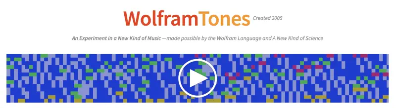

Almost all assets were defined! It was a little over the 13 KB limit, though. Even after re-compressing the zip file with [ECT](https://github.com/CT1994/ect-bin).

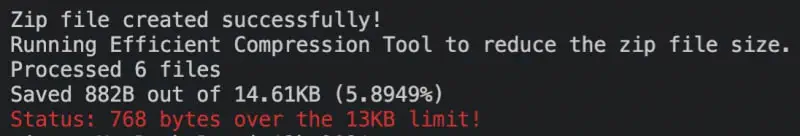

It's worth mentioning that the bundle was generated with [Vite](https://vite.dev/), and the code was written entirely in [Typescript](https://www.typescriptlang.org/).

Then, while investigating ways to improve the compression, two things were changed.

- The javascript bundle generated by Vite (which already inline images in base64) was minified even more with [Roadroller](https://lifthrasiir.github.io/roadroller/).
- And Instead of adding a CSS, a JS and a HTML file to the zip, everything was inlined in `index.html`.

It was enough to reduce the zip file that much:

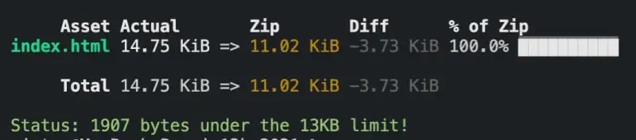

After that, I used [Piskel](https://www.piskelapp.com/) to extract only the frames I needed from the sprite sheets. Then sent them through [Squoosh](https://squoosh.app/) to convert to WEBP with the smallest possible size.

At this point, I had three levels ready, which was enough to test the gameplay. It was fine on all desktop browsers. And there was a considerable amount of space left, so I decided to add mobile support.

I first tried adding a virtual joystick for mobile, but it took up too much space on the screen. Also, it wasn't too easy to control the character with it. So I decided to replace them with buttons and found the [Keyboard Keys](https://cazwolf.itch.io/caz-pixel-keyboard) by [Caz](https://cazwolf.itch.io/), which matched the gamed colors and pixel art. Had to reduce the level area by 50 pixels, to open space for the bottom bar with buttons and text.

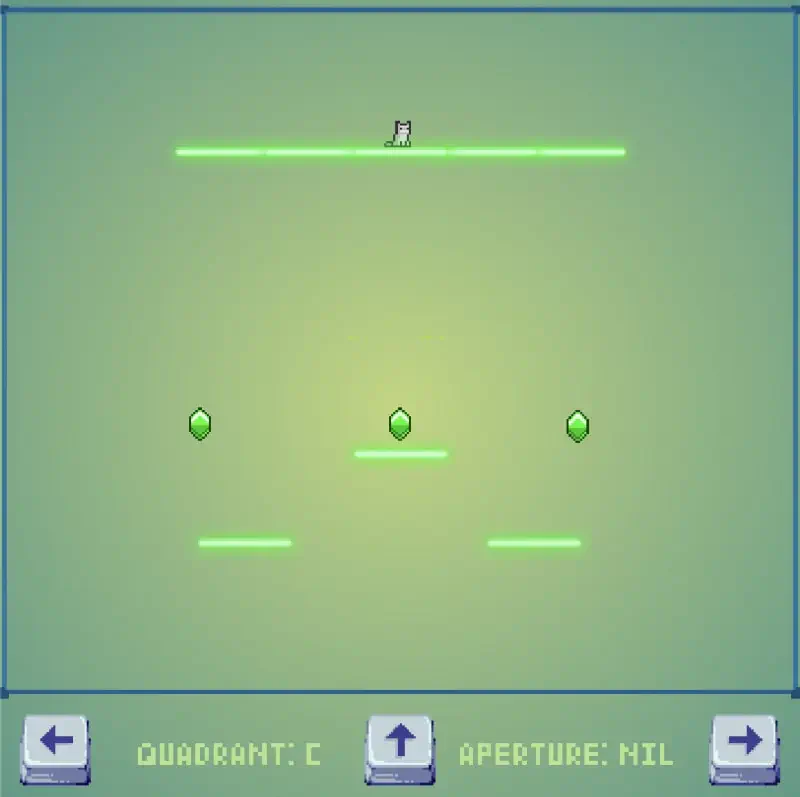

An important discovery at this moment was the `image-rendering: pixelated` CSS rule to don't blur the game while scaling.

With this, the 360x360 canvas was fulfilled, and the only thing left to do was add more levels.

Adding levels was pretty easy, as they are simply based in two arrays holding positions: one for platforms and another for green gems. Moreover, both array objects are linked to their respective [pool of game objects](https://straker.github.io/kontra/api/pool), so I can add/remove them with a single instruction. And to speed up this level edition, I used [Tweakpane](https://tweakpane.github.io/docs/), which allowed me to edit while playing.

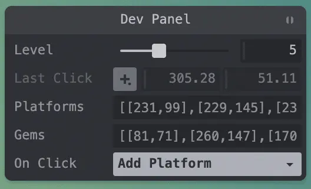

The game was submitted a couple of hours before the deadline, and it's available on its [JS13K Game Page](https://js13kgames.com/games/cat-goric-escape-from-the-warp-chamber), along with [222 other games](https://js13kgames.com/2021/games) that we're now [judging](https://medium.com/js13kgames/voting-and-feedback-7aa38c8b4c2e) to find out the most loved ones! (Check the [Top 10 from last year](https://github.blog/open-source/gaming/top-ten-games-from-the-js13k-2020-competition/)!)

And I've already seen some people playing it! ([Pablo Tescospar on Twitch](https://www.twitch.tv/videos/1150579150?t=00h58m32s))  
[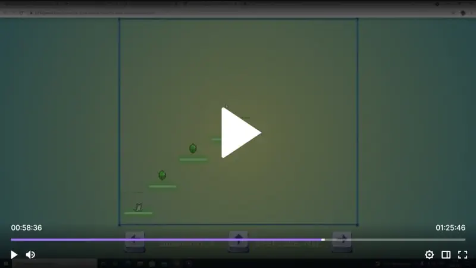](https://www.twitch.tv/videos/1150579150?t=00h58m32s)
I wish I had more time to add a proper laser asset, a game menu, more levels and other challenges. But that's all I could do in this timeframe.

For anyone interested in playing the game, the latest version is available in Itch.io: [Cat Goric: Escape from the Warp Chamber](https://felladrin.itch.io/cat-goric-escape-from-the-warp-chamber)
