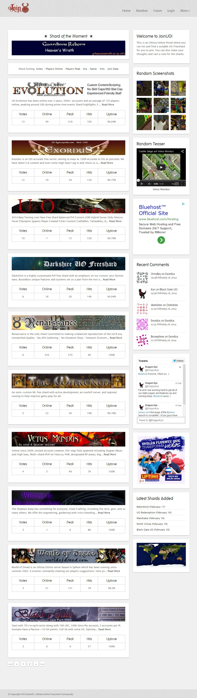

# JoinUO

After dropping UO Is Not Dead, I've joined the JoinUO team to make a new portal, today available at https://uoportal.com/

For this, I've used the PHP Yii Framework. The site template was not designed by me, it was available for free on the Internet.

The source code is available at [https://github.com/felladrin/joinuo](https://github.com/felladrin/joinuo)
