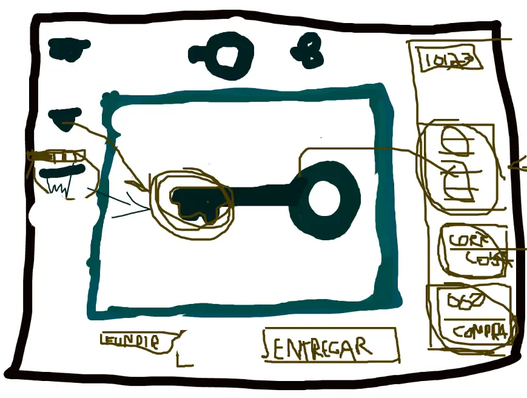
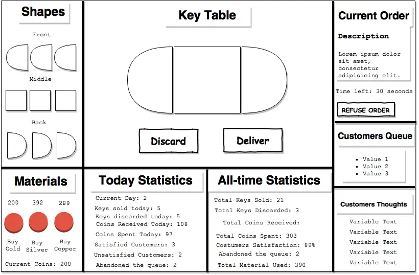
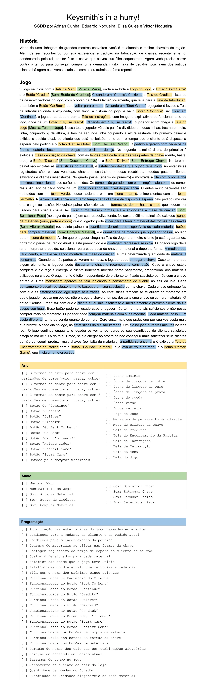
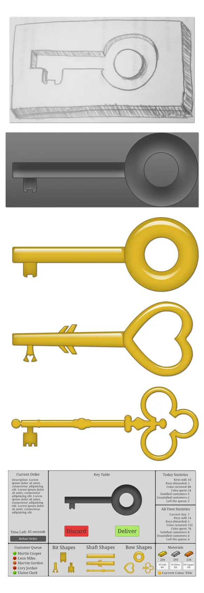
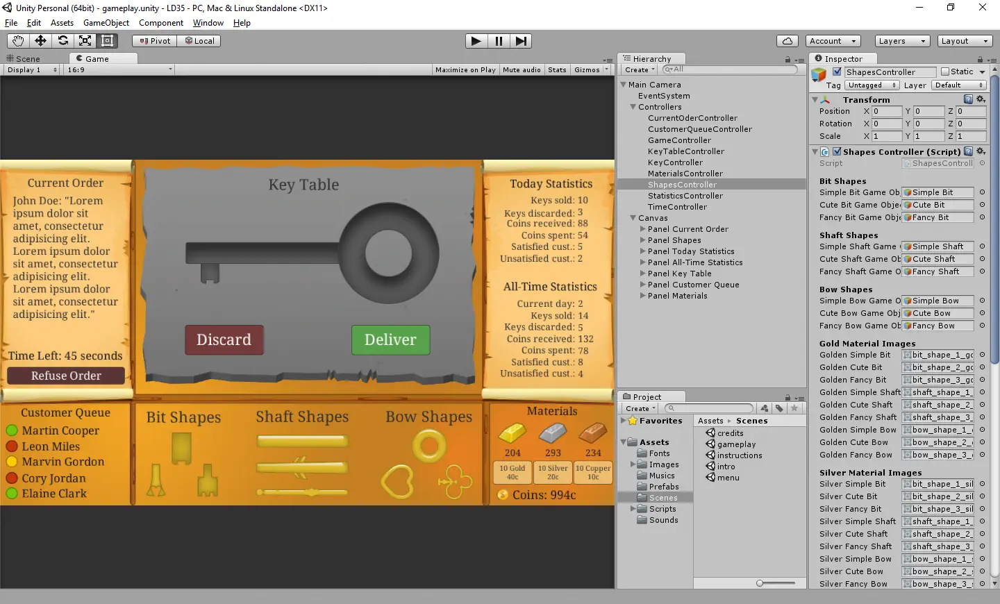
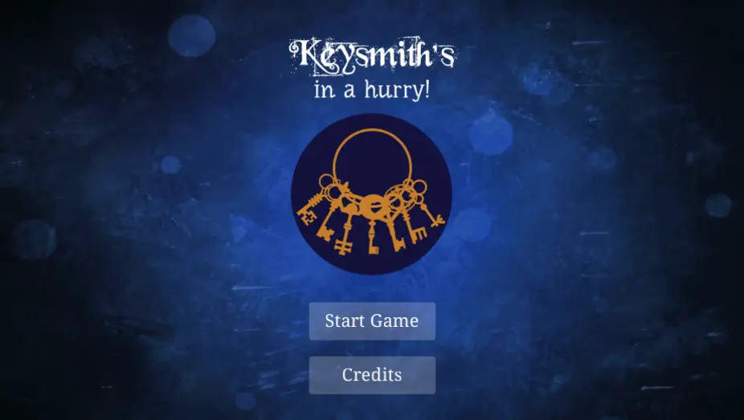

# Keysmith’s in a hurry!

A musician, a business administrator, an architect and a programmer. Not really a gamedev team; just a group of close friends looking for fun! And now we here to share the experience we had on the creation of [Keysmith’s in a hurry!](http://ludumdare.com/compo/ludum-dare-35/?action=preview&uid=46558)

We’ve met online at _talk.gg_ just a few minutes before the theme announcement. At that moment we had already set a roadmap for the game development, as the following:

1. _Theme brainstorming_
2. _Mockups and game name choosing_
3. _SGDD writing_
4. _Game assets and scenes creation_
5. _Game programming_
6. _Game sounds and musics inclusion_
7. _Game publishing_
8. _Post-Mortem writing_

As soon as they announced the theme, we’ve started the brainstorm. Monsters, food, spaceships, rogue-like, quiz, game board, popcorn and a lot of crazy ideas… Until we finally got to the _key-idea:_ to shapeshift keys for npcs that would tell a single-line story about why they needed a key. So this was the first mockup, made on _Flockdraw_:

_1º Mockup for Keysmith’s in a hurry!_

We’ve spent a lot of time discussing the game features and drawing the interface. Later we moved to [draw.io](http://draw.io/) for a better mockup:

_3º Mockup for Keysmith’s in a hurry!_

With the mechanics and interface defined we could start thinking about the name. We’ve came across a lot of ideas. From the ok ones (_Keymaker; Keymaster Legacy; Keystorm_) to the awful ones (_The Insane Adventure of the All-Keys Maker; Lord of the Keys; Keymberly!_). In the end, we’ve picked the name _“Keysmith’s in a hurry!”_ mainly because how it sounds. Also, no game has ever been made with that name.

Next step: writing the SGDD. _[SGDD stands for Short Game Design Document, a development documentation method for small-size games. Original article, in brazilian portuguese: [https://goo.gl/wNf46h](https://goo.gl/wNf46h)]_

We did it collaboratively using [Google Docs](https://docs.google.com/):

_For demonstration purposes we’ve reviewed and prettified it before posting here. During the jam it was a little messy due the lack of time.

Having the development guide, it was time to start creating the assets on [Photoshop](https://www.adobe.com/products/photoshop.html) and the scenes on [Unity3D](http://unity3d.com/). Here you have some records of this moment:

_Assets & Game Scene._

With the assets and scenes in hand, it was time to make a game of it. Make the static become dynamic. At the moment we started programming, we remembered to turn [Chronolapse](https://github.com/collingreen/chronolapse) on: [https://goo.gl/S89bY3](https://goo.gl/S89bY3)

The game was all scripted using [MonoDevelop](http://www.monodevelop.com/). Meanwhile the soundtracks were being created with [Cubase](http://www.steinberg.net/en/products/cubase/start.html). Also we’ve included sounds on buttons and made some improvements on the UI:

_Our game on Unity3D._

Finally, a few minutes before the deadline we’ve [published](http://ludumdare.com/compo/ludum-dare-35/?action=preview&uid=46558) it!

_Click this image to play our game!_

Time for a well deserved rest before start writing the post-mortem!

## Game Specifications, Experience and Feedback

### Mechanics

It’s a game about resources management. In summary, each round the player needs to read a order description (to know what kind of key he needs to create), choose the material he wants to use for each part of the key and then click on the shape of the key they want to add to the key table (where the key is assembled). After the key is delivered, the next customer comes in and the next round starts. There’s a time system, but not so useful as we couldn’t implement it further; it only resets the current day startistcs every day. The statistics are currently the only feedback the player has for the customer’s opinions about the keys created.

The game targets computer web browsers, and all the interaction is made through mouse clicks on several buttons from the gameplay screen. It’s a simple and functional game, but due to it’s linear gameplay, it gets boring after five minutes.

### Aesthetics

We’ve focused the aesthetics on something reminding middle ages. All assets were based on this premise. So you see medieval keys, hear medieval coins and listen medieval songs among the game. The game is all in one screen because we had not much information beside numbers.

### Story

We’ve setup a short background story just to let the player understanding why was he clicking all those buttons. As you can read in-game, the backstory is:

_“Descendant from keysmith masters, you are currently the best keysmith of the region. Besides being recognized for your excellence and tradition in the manufacture of keys, you were recently knighted by the king, for creating the key that saved his kidnapped daughter. Now you need to race against time to meet the demands from your old customers in addition to those who are curious about your work and sudden fame.”_

### Technology

We’ve developed the game on Unity3D, but decided to export only to WebGL (HTML5), so our game is basically a web browser game. The best thing about HTML5 is that anyone with a uptodate web browser can play it. Besides the game engine, we’ve used a lot of great and modern tools to make this game exist, as you’ve read above.

### What we’ve learned

One of the first things we’ve noticed is that not everyone is prepared for the [Pomodoro Technique](https://en.wikipedia.org/wiki/Pomodoro_Technique). We used it on the first day, but not everyone could stop their work on the intervals. So we didn’t use it on the following days. But we’ll definitely try it again on the next jam.

Having an SGDD as a development guide helps a lot. Once the game tasks are defined, we just need to follow the list!

Our strategy of using controllers+events on the programming was not perfect; we still had some scripts referencing others directly. We’re already studying new techniques for that.

### The Bad

We all agree that it took us too long discussing the game ideia. Besides that, we needed to change tools (for conference and drawing mainly) several times, due to the lack of functionalities or for not working on some members computers. We should have tested the tools in group before starting.

At the end of the jam we didn’t complete the programming task list from the SGDD: there should be a feedback message for the player to know what the client thought about the key. We’d do it through a message box that would slide down from the top of the window (you can see it being implemented on the timelapse video). But it was cancelled due to the deadline. We also missed the game over conditions, that was already defined on the SGDD. And also a few fixes, like disable the Deliver button if the key had only one or two of the three parts and disable the Discard button if the key table was already empty.

We’ve spent some time to share assets. Using a shared folder on Dropbox would accelerate our work.

### The Good

The best part was the laughs! We laugh a lot! That was enough to make that time count! But we also liked alot our teamwork. So much effort put on it!

We’re all proud we could make the random customers orders work; to see the different combinations of keys with only a few assets; to try out those techniques (Pomodoro and SGDD) and know it works; to see our UI design being so much appreciated when we had no one to focus on the art.

All this gave us a very pleasant experience overall.
