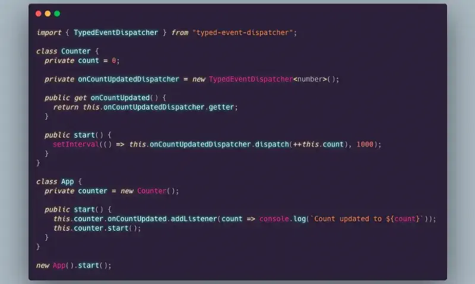
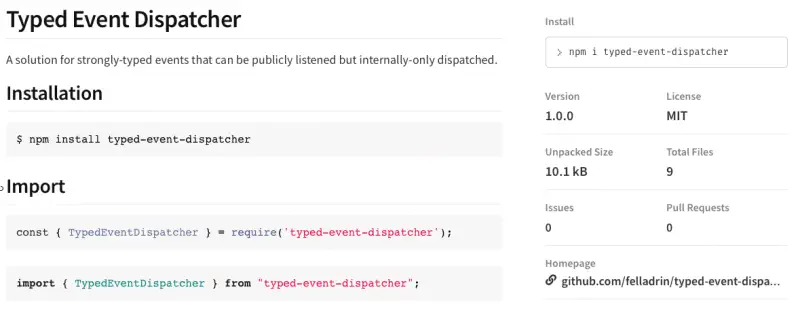
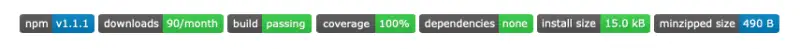

# Lessons from publishing an NPM Package

## The Quest

I always wanted to retribute the community for all those packages I use every day, but I couldn’t think of anything useful enough to be shared. For everything we can think of, there’s already at least one good package on [NPM](https://www.npmjs.com/)!

Fortunately, the opportunity for my contribution came in when I needed a package for dispatching strongly-typed events from one class to another, as in the [Observer Pattern](https://en.wikipedia.org/wiki/Observer_pattern).

Well, in fact, there is a [brunch of solutions for this](https://www.google.com/search?q=(typed+OR+type)+(event+OR+signal)+(dispatcher+OR+emitter)++site:npmjs.com) already shared on NPM. If we close our eyes and click a random search result, we should be in good hands — there are excellent libs! But what I had in mind was very specific.

I was looking for a solution providing strongly-typed events that could be publicly listened but internally-only dispatched, fitting for both [TypeScript](https://www.typescriptlang.org/)and [JavaScript](https://developer.mozilla.org/en-US/docs/Web/JavaScript) codebases.

## The Adventure

Considering I had the whole spec in mind at that point, I decided to give it a try and implement it in [Back Read](https://github.com/felladrin/js13k-2019), a game prototype that I had recently submitted for the [Js13kGames](https://js13kgames.com/entries/back-read) competition.

Worked like a charm! I was euphoric! So I quickly extracted the code to a new repository and initialized an NPM package. [Linked](https://docs.npmjs.com/cli/link.html) it to my game repository and… _voilà_! A new package was born!

But wait! Not so fast…

## The Challenge

Having a pack of source files is [not enough](https://changelog.com/posts/top-ten-reasons-why-i-wont-use-your-open-source-project). A decent _Readme_, a well-defined _package.json_, minimal examples, and test coverage are the least we expect when looking for a lib on NPM. So, after reading some articles from experienced package maintainers, I did it all and more.

By the way, [GitHub](https://github.com/) has nice [Open Source Guides](https://opensource.guide/) for helping with it.

## The Achievement

Finally, it was in good shape to be shared on the NPM registry. So I logged in via command line and [published](https://docs.npmjs.com/cli/publish) it!

[Typed Event Dispatcher](https://www.npmjs.com/package/typed-event-dispatcher) was live! But now, how to let other devs know about it?

## The Storytelling

This step is also important for the new package to have a good start. Developers spread the word about their libs through blog posts ([Changelog.com](https://changelog.com/), [Dev.to](https://dev.to/), [Medium](https://medium.com/), [LinkedIn](https://www.linkedin.com/)), social updates ([Twitter](https://twitter.com/), [Facebook](https://facebook.com/)), chats ([Slack](https://slack.com/), [Discord](https://discordapp.com/)), answers on Q&A portals ([StackOverflow](https://stackoverflow.com/), [Quora](https://www.quora.com/)), forums, messengers and also in [Meetups](https://www.meetup.com/find/?categoryId=546), [Conferences](https://confs.tech/).

Letting people have a glance at the project highlights using badges helps too. For this, [Shields.io](https://shields.io/) provides almost everything needed.

## The Final Act

After that, we just need to [keep the package updated](https://docs.npmjs.com/packages-and-modules/), with [repository issues](https://help.github.com/en/github/managing-your-work-on-github/about-issues) resolved and the installs number will gradually increase. From now on, maintenance is the key.

Keep in mind that developers are more and more concerned about dependency bloat, so, besides quality and coverage, they value small-size and few-dependencies. Projects like [BundlePhobia](https://bundlephobia.com/) were born for it and should be used for self-checking.

I hope these thoughts can help those who are giving their first step into NPM publishing.

Have a great journey!
