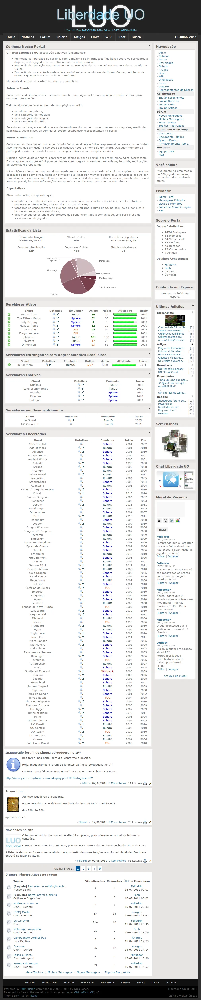

> Projeto que listava Shards Brasileiros de Ultima Online, informando detalhes sobre os que estavam ativos e também sobre os já encerrados. Além disso era possível enviar screenshots, discutir sobre o jogo no fórum, e conversar com outros jogadores através de um chat de voz. Foi idelizado em 2008, implementado em 2009 e permaneceu ativo até meados de 2012. Usava como base um CMS em PHP chamado PHP-Fusion.