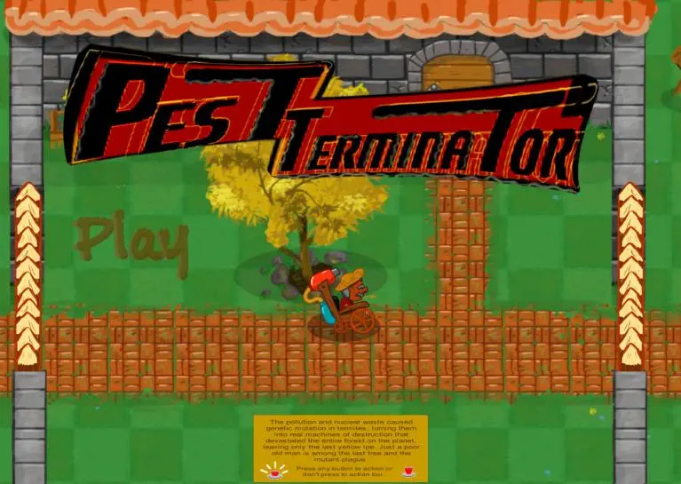
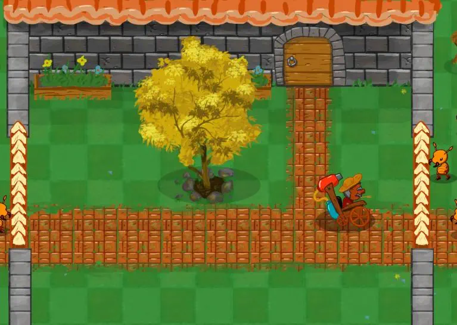
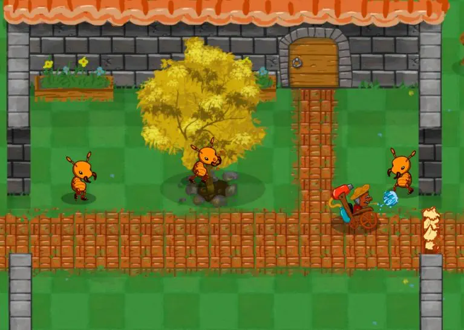

# PestTerminator

> The pollution and nuclear waste caused genetic mutation in termites, turning them into real machines of destruction that devastated the entire forest on the planet, leaving only the last yellow Ipe. Just a poor old man is among the last tree and the mutant plague.

Unity game developed by five people over the 48-hour Global Game Jam. I role-played as a programmer.

You can still download and play this game at [Global Game Jam: PestTerminator](https://globalgamejam.org/2015/games/pestterminator).