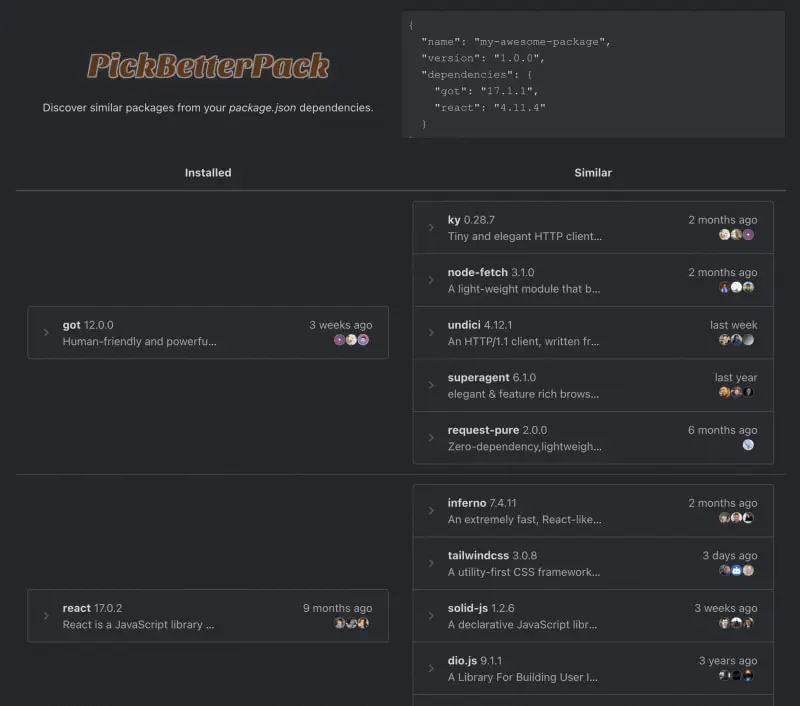

# PickBetterPack is now open source!

[PickBetterPack](https://pickbetterpack.com/) allows developers to discover similar packages from dependencies listed in package.json. And it's now [open on GitHub](https://github.com/felladrin/PickBetterPack)!

