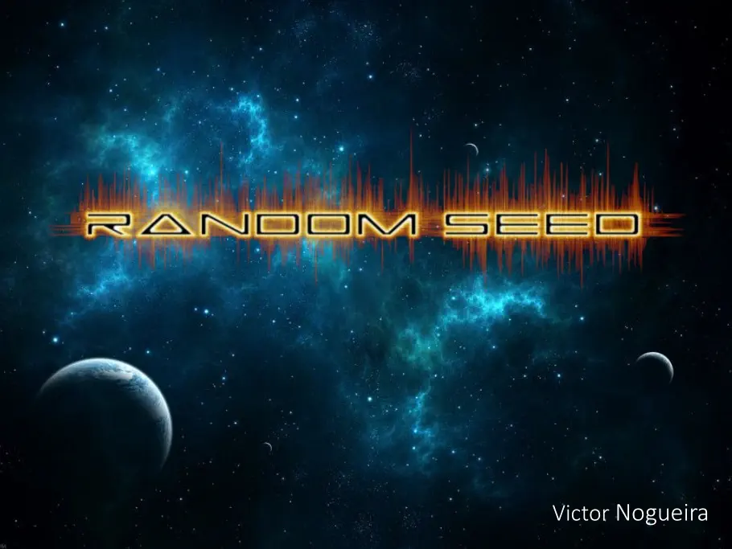
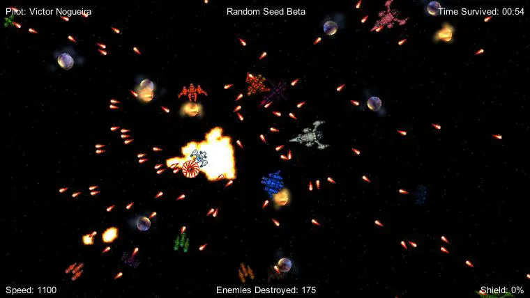

# Random Seed

Random Seed is a 2D survival space shooter where you, as the last pilot from the alied forces, needs to keep alive as long as you can in the enemy territory.

It was my first game made with Unity. That's where I've learned almost all the basics of the engine. I've spent a lot of time on it, compiling and recompiling it to get a good balance level. It's a game meant to be played for no more than three minutes.

It's linked to facebook (you can see, on the top-left the facebook user name), and there's a scoreboard at the end of the game, linked to your facebook profile. This scoreboard (player ranking) is available at a website.

The game mechanics are pretty simple. You move the mouse, the white ship follows the mouse. You click, and the ship fires. So you need to survive an infinite waves of enemies as long as you can, being supported by some powerups left by enemies. You can also count on some special items that spawn on screen to kill all around.

Although it has an orthographic view, it was made on the 3D enviroment, instead of the 2D (Unity already supported that at that moment).

I've named it "Random Seed" as a tribute to this computational concept so much used in this game. Almost everything is random: colors, quantities, speeds, locations...