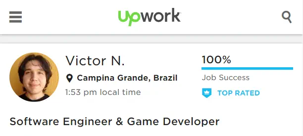

# The Freelance Career on Upwork

"You don't have to be great to start, but you have to start to be great." (Unknown Author)

When I decided to become a freelancer, I received the support I needed. The people who knew me trusted me. However, there was a common concern: what if it doesn't work out?

Leaving a good job to become a freelancer can be scary. But I believed that this mostly happened due to a lack of planning because statistics also showed positive data about freelancers. So I needed to give it a try.

With the strategy of starting small and gradually expanding my portfolio, I tried various platforms that aggregated freelance professionals: [Freelancer.com](https://www.freelancer.com/), [Workana.com](https://www.workana.com/), [Upwork.com](https://www.upwork.com), [Fiverr.com](https://www.fiverr.com/), and others. Offering my services on my own was out of the question because I had already compared the chances I would have using or not using one of these platforms and concluded that, being introverted, it would be better to expose my profile and let clients compare me with other candidates. That's how most of these platforms work.

After two weeks of exploration, I felt that the most organized platform that suited me best was [Upwork](https://www.upwork.com).

<iframe width="560" height="315" src="https://www.youtube.com/embed/ZzfPV8d_wfk" frameborder="0" allowfullscreen></iframe>

From then on, I started investing my working time exclusively on Upwork, searching for opportunities and improving my profile.

The freelancer profile on Upwork needs to have everything a potential client might want to know. So before creating mine, I analyzed dozens of [Top Freelancer profiles](https://www.upwork.com/o/profiles/browse/nss/90/hrs/1000/?revenue=10000&rate=60&pt=independent&english=2) to use as a reference. This helped me a lot.

Thus, on any of these platforms, the most challenging part is getting the first *job*. How can you prove that you're qualified if your freelance work history is still empty? This is where extra activities come in; projects developed on your own and/or with authorization to showcase them as your own.

In my case, I had a GitHub profile with several repositories of apps and games that I had developed over the past seven years. It was essential in securing my first contract with a company from the United States.

I successfully completed that first project. And with the number of accumulated working hours, it became much easier to be hired for other projects.

In other words, the time spent on the platform and the work done through it are recorded on the freelancer's profile, which usually contributes positively when it comes to selection for a job.

Badges on the profile also matter a lot on Upwork. Currently, there are two: [Rising Talent](https://support.upwork.com/hc/en-us/articles/211063228-Become-a-Rising-Talent) and [Top Rated](https://support.upwork.com/hc/en-us/articles/211068468-Become-Top-Rated). The first one is relatively easy to obtain; you just need to pass a test by Upwork, fill out the profile completely, and stay active on the platform. The second one requires patience and dedication, and it will come with time for those who demonstrate good results to clients.

On Upwork, the more specialized you are, the higher your chances of getting jobs. So whenever you acquire a relevant certificate or complete a project, don't hesitate to describe it on your profile.

As T. Harv Eker says in *Secrets of the Millionaire Mind*: in the real world, if you don't sell yourself, no one will do it for you.

[Skills Tests](https://support.upwork.com/hc/en-us/articles/211063198-Skills-Tests) are also important on the platform. Test results can be displayed on your profile, emphasizing your professional qualifications. Tests can be retaken after a certain period if the score is low and can be hidden on the profile at the freelancer's discretion.

Occasionally, Upwork itself organizes webinars to discuss ways to attract more visibility to your profile. In addition, on their YouTube channel, they maintain a [playlist with tips for freelancers](https://www.youtube.com/watch?v=Q2ldxwKF2ss&list=PLCfjqPPfH_dZuTW2g1CC8U7wjxcpAmoqP), on their website, [a help center](https://support.upwork.com), and [a blog full of articles on the subject](https://www.upwork.com/blog/).

The jobs published on the platform are divided into [two types of payments](https://support.upwork.com/hc/en-us/articles/211063418-Hourly-vs-Fixed-Price-Contract-Differences): hourly rate or a fixed amount per project/milestone. It's up to the freelancer to evaluate which one is more worthwhile.

> It is essential to study the platform to make the most of it.

Today, with good experience on the platform, I feel satisfied with the clients I serve through it and grateful for the feedback I have received so far.

正勝吾勝
