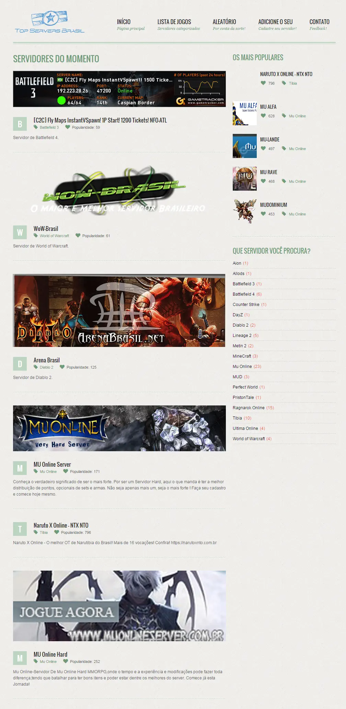

# Top Servers Brasil

First website dedicated to listing Brazilian private and free servers!

With the aim of guiding the Brazilian community in choosing quality servers, Top Servers Brasil lists the best private and free servers in the country!

The features of the system include:

- Randomly displayed servers on the homepage;
- Generation of a simple banner for registered servers without a banner;
- Generation of thumbnails via JavaScript, using the [recrop](https://github.com/felladrin/recrop) library;
- Visits count for each server;
- Users can add servers without the need for registration.
- Categorization of servers by the name of the game they belong to, and count of servers in each game (games without registered servers are not listed).
- Automatic removal of servers whose websites no longer exist.
- Administration panel for managing registered servers.