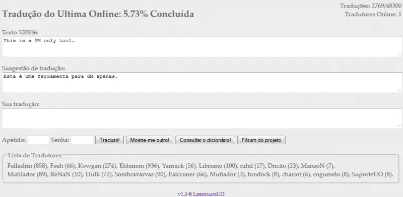

# Ultima Online Translation Tool

This was a tool created to organize the community translation of the Ultima Online game, carried out on the Portal Liberdade UO. The system is no longer active, due to the loss of interest on the part of the few remaining players. However, I will explain how it worked, so that it may serve as a basis for similar ideas.

Upon opening the translation page, the following was displayed:

- percentage of translation completed;
- number of translators working on the translation at that moment;
- random text from the cliloc.enu that had not yet received a translation;
- translation suggestion, provided through Google Translator's API;
- area for the user to write their translation of the presented text;
- login fields (with the same password for everyone), simply to prevent spambots from using the tool;
- list of translators, with the nicknames of those who helped in the translation and the respective quantities of texts translated.

A MySQL database stored the information:

- text to be translated;
- translation;
- translator's nickname.

The user could also consult the dictionary directly from that page. The search was carried out in the Michaelis Online English Dictionary. And they could skip to another text if they did not know how to translate the current one.

Some rules and standardizations that ensured the effectiveness of the system were defined in the forum.

There was a second phase planned, which would be the review of all translations. The layout of the texts on the screen would be different, as well as the information recorded in the database. However, this phase was not implemented.

You can see that a translation system is quite easy to implement. If there are well-defined rules/goals and active participants, the translation is bound to succeed, even in a simple system like this.