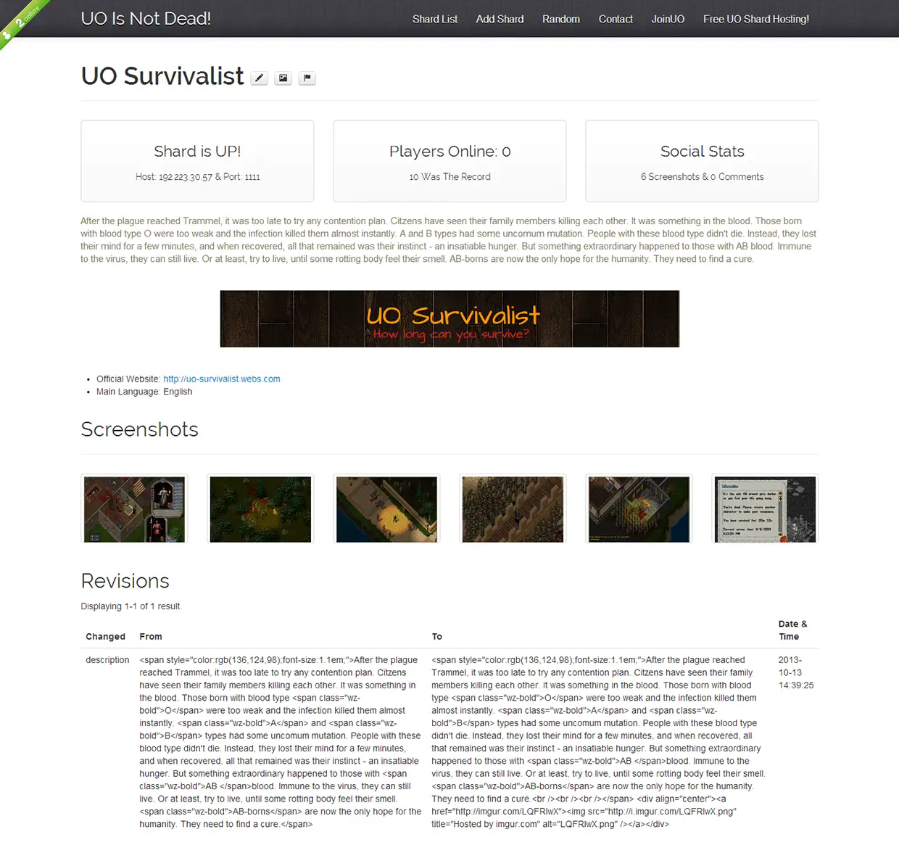
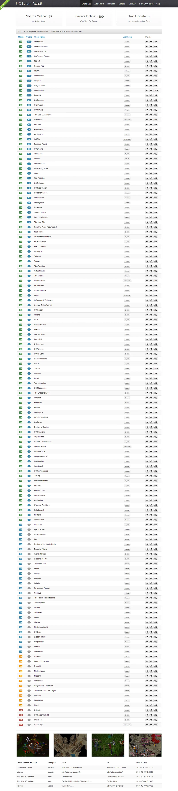

# UO Is Not Dead!

> A shard's details page containing: shard's address, players online count, statistics, description, banner, links, screenshots, and a revision history of the page.

> The shard list, followed by some screenshots and some recent updates. On the header you can see some statistics to prove UO was not dead. Also, beside each shard, there was a counter of how many players were online at the moment.

UO Is Not Dead was a global listing of Ultima Online Freeshards, expecting to prove that there was yet a lot of shards out there.

It was not based on voting system, it was like a wiki.

Anyone could edit any shard at any time, and a revision history was kept to help people to undo eventual mistakes.

Anyone could add a shard on the list without the need of an account.

When clicking on a shard name, user could see a lot of details about the shard and also add/edit information and screenshots.

The website was totally programmed using Yii Framework (PHP). MySQL was used to hold the data. And the layout was based on Twitter Bootstrap.